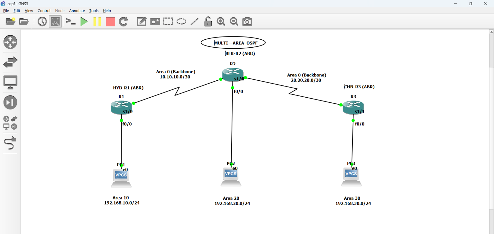

# Multi-Area OSPFv2 Lab in GNS3


## Overview

This project implements a multi-area OSPFv2 topology in GNS3 using three Cisco IOS routers and three LAN segments.

The design uses Area 0 as the OSPF backbone. Each router connects one local LAN area to the backbone and therefore functions as an Area Border Router (ABR).

The project demonstrates:

- OSPFv2 configuration using network statements
- Multi-area OSPF hierarchy
- Area 0 backbone connectivity
- Area Border Router operation
- OSPF neighbor establishment
- Inter-area route learning
- OSPF link-state database verification
- End-to-end IPv4 connectivity testing

## Topology



## Devices

| Device | Hostname | Router ID | Role |
|---|---|---:|---|
| R1 | HYD-R1 | 1.1.1.1 | Hyderabad ABR |
| R2 | BLR-R2 | 1.1.2.2 | Bengaluru ABR |
| R3 | CHN-R3 | 1.1.3.3 | Chennai ABR |

## IP Addressing Plan

| Device | Interface | IP Address | Subnet Mask | OSPF Area |
|---|---|---|---|---:|
| HYD-R1 | FastEthernet0/0 | 192.168.10.1 | 255.255.255.0 | 10 |
| HYD-R1 | Serial1/0 | 10.10.10.1 | 255.255.255.252 | 0 |
| BLR-R2 | FastEthernet0/0 | 192.168.20.1 | 255.255.255.0 | 20 |
| BLR-R2 | Serial1/0 | 10.10.10.2 | 255.255.255.252 | 0 |
| BLR-R2 | Serial1/1 | 20.20.20.1 | 255.255.255.252 | 0 |
| CHN-R3 | FastEthernet0/0 | 192.168.30.1 | 255.255.255.0 | 30 |
| CHN-R3 | Serial1/1 | 20.20.20.2 | 255.255.255.252 | 0 |

## OSPF Area Design

| OSPF Area | Purpose | Network |
|---:|---|---|
| 0 | OSPF backbone | 10.10.10.0/30, 20.20.20.0/30 |
| 10 | Hyderabad LAN | 192.168.10.0/24 |
| 20 | Bengaluru LAN | 192.168.20.0/24 |
| 30 | Chennai LAN | 192.168.30.0/24 |

## OSPF Configuration Summary

### HYD-R1

```text
router ospf 1
 router-id 1.1.1.1
 network 10.10.10.0 0.0.0.3 area 0
 network 192.168.10.0 0.0.0.255 area 10
```

### BLR-R2

```text
router ospf 1
 router-id 1.1.2.2
 network 10.10.10.0 0.0.0.3 area 0
 network 20.20.20.0 0.0.0.3 area 0
 network 192.168.20.0 0.0.0.255 area 20
```

### CHN-R3

```text
router ospf 1
 router-id 1.1.3.3
 network 20.20.20.0 0.0.0.3 area 0
 network 192.168.30.0 0.0.0.255 area 30
```

## Verification

### OSPF neighbors

All Area 0 neighbor adjacencies successfully reached the FULL state.

```text
HYD-R1 --- FULL --- BLR-R2 --- FULL --- CHN-R3
```

| Router | OSPF Neighbor | Interface | State |
|---|---:|---|---|
| HYD-R1 | 1.1.2.2 | Serial1/0 | FULL |
| BLR-R2 | 1.1.1.1 | Serial1/0 | FULL |
| BLR-R2 | 1.1.3.3 | Serial1/1 | FULL |
| CHN-R3 | 1.1.2.2 | Serial1/1 | FULL |

### OSPF routes

Inter-area routes were successfully installed in the routing tables.

```text
HYD-R1# show ip route ospf

O IA 192.168.20.0/24 via 10.10.10.2
O IA 192.168.30.0/24 via 10.10.10.2
```

```text
BLR-R2# show ip route ospf

O IA 192.168.10.0/24 via 10.10.10.1
O IA 192.168.30.0/24 via 20.20.20.2
```

```text
CHN-R3# show ip route ospf

O IA 192.168.10.0/24 via 20.20.20.1
O IA 192.168.20.0/24 via 20.20.20.1
```

### Connectivity

Successful ICMP tests verified routing between all areas.

```text
HYD-R1# ping 192.168.20.1
Success rate is 100 percent (5/5)

HYD-R1# ping 192.168.30.1
Success rate is 100 percent (5/5)

BLR-R2# ping 192.168.10.1
Success rate is 100 percent (5/5)

BLR-R2# ping 192.168.30.1
Success rate is 100 percent (5/5)

CHN-R3# ping 192.168.10.1
Success rate is 100 percent (5/5)

CHN-R3# ping 192.168.20.1
Success rate is 100 percent (5/5)
```

## Useful Commands

```text
show ip interface brief
show ip ospf neighbor
show ip ospf interface
show ip ospf database
show ip route
show ip route ospf
show ip protocols
```

## Notes

- Area 0 is the backbone area and connects all non-backbone OSPF areas.
- HYD-R1, BLR-R2, and CHN-R3 operate as ABRs.
- The `O IA` route code identifies OSPF inter-area routes.
- OSPF router IDs are logical identifiers and are not automatically reachable addresses unless they are assigned to an interface, such as a loopback interface.

## Author

surendra

## License

This project is available for educational and laboratory purposes.
